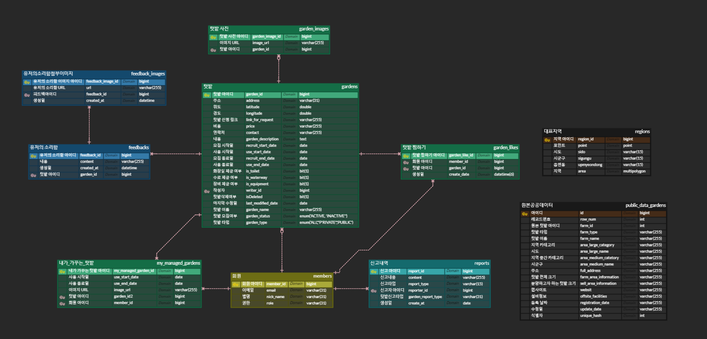

# 모두의 텃밭  Version 2
[텃밭 분양 중개 및 농작물 거래 플랫폼 ]

# 프로젝트 기획 배경

 
소규모 텃밭을 가꾸고자 하는 사람들의 수요가 높아지면서, 텃밭 분양 정보의 분산으로 어려움을 겪는 사람들을 위해 기획한 어플리케이션입니다.
 
텃밭 분양의 임대인, 임차인을 연결지어 서비스 이용자에게 텃밭 분양에 있어 좋은 경험을 제공하는 목표를 갖고 시작했습니다.

 
## 제공하는 기능

[🔗 UI & 기획 보러가기](https://drive.google.com/file/d/1p_-xn_9S3aIM1M0XYIue_OhVxITXm5Et/view?usp=sharing)
- 네이버, 카카오 로그인
- 내 주변 텃밭 분양 중개
    - 사용자 위치에 따른 주변 텃밭 매물 정보 목록 조회
    - 지역 검색을 통한 텃밭 매물 정보 목록 조회
    - 텃밭 상세보기 제공 (이미지, 시설물 정보, 모집 마감일 등)
    - 텃밭 찜하기 
    - 텃밭 매물 등록하기 
    - 허위 매물 신고하기
- 유저의 소리함
- 날씨 데이터 제공
  - 위치 정보 미동의 시, 랜덤한 지역 날씨 데이터 제공 ( 하늘상태, 현재 온도)
  - 위치 정보 동이 시, 현재 지역 날씨 데이터 제공 ( 주간날씨, 시간별 날씨)
- 월별 추천 작물
- 내가 가꾸는 텃밭 등록
    - 내가 가꾸는 텃밭 등록하기 (이미지 등록)
    - 사용 마감일로부터의 D-DAY 정보 제공
 

# 프로젝트의 주요 관심사
- 실제 서비스 가능한 완성도로 서버-클라이언트 구현(API, UI, 통신 규약, 기능성)
- 소켓 통신을 통한 동시 편집 구현
- 캐시, DB 통신 최소화를 통한 성능 최적화
- 서버 확장, 대용량 트래픽과 운영을 고려한 방식
- 성능테스트를 통한 튜닝
- 로직이 잘 보이고 확장, 유지보수하기 좋은 코드

## 사용한 기술
- Spring Boot 3.2.0
- Java 17
- Spring Data JPA
- MySQL 8.0
- nginx
- GithubAction
- SonarCloud
- Naver Cloud Platform

## 인프라 구조

- Naver Cloud Platform의 서버로 구성되어 있습니다.
- github action에서 main 브랜치 push 이벤트를 감지하고 NCP에 SSH 접속을 합니다.
- 서버 내에 있는 build.sh 스크립트를 실행하여 깃 리포지토리의 main 브랜치를 클론하고 빌드를 합니다.
- build가 완료되면 deploy.sh를 실행하여 빌드된 jar 파일을 실행합니다.
- 헬스체크 완료 후 nginx의 리버스 프록시 포트가 변경되어 중단 없이 배포 됩니다.

# 프로젝트를 진행하며 겪은 문제와 해결과정
## 코드
[🔗 거미줄 같이 얽혀있는 코드를 리팩토링 하기1](https://joyfulviper.tistory.com/100) 
[🔗 거미줄 같이 얽혀있는 코드를 리팩토링 하기2](https://velog.io/@byeolhaha/%EB%A0%88%EA%B1%B0%EC%8B%9C-%EC%BD%94%EB%93%9C%EB%A5%BC-%EC%A0%9C%EA%B1%B0%ED%95%98%EB%A9%B0)

 

# ERD

 

# 이전 버전에 비해 개선된 점
- 공공 텃밭 데이터 100개 -> 공공 텃밭 데이터 800개
- 0%의 테스트 커버리지 -> 80%의 테스트 커버리지
- 전국 지도 데이터 행정동 -> 법정동 데이터로 변경
- 각 법정동에 대한 multipolygon, 중심 좌표 데이터 구축
- 지도 텃밭 검색시 인덱스를 사용하지 않는 쿼리를 R-Tree index를 사용하도록 쿼리 개선
- db에 저장할 필요가 없는 데이터(최근 본 텃밭, 시도의 지역코드, wiki에서 가져온 작물 데이터)을 로컬 메모리에 저장하는 방식으로 변경하여 네트워크 비용 감소 및 속도 개선
- docker, redis 제거
- 관심사 모듈 분리(core, batch, chat, api)
- WebFlux의 webClient 기반의 api 호출 방식 -> feign, circuitbreaker 기반으로 변경하여 중복 코드 제거, 불안정한 공공 api의 장애전파 방지
- 전국의 날씨 정보를 얻기 위해 17개의 시도에 api 호출해야 하는 상황에서 기존의 동기로 호출하는 방식을 비동기 방식으로 변경 (16초 -> 1초) 성능개선
- 인프라 변경 aws -> ncp
- CI 액션(SonarCloud)을 추가하여 매번 pr을 올렸을 때 코드 스멜, 보안 위배 요소, 중복 코드, 테스트 커버리지를 분석 받아 코드 품질 관리

# 운영중인 사이트
<a href=https://everyonesgarden.vercel.app/>모두의 텃밭</a>

# 농림축산 식품부 창업 경진대회 우수상
농림축산 식품부에서 주최한 창업 경진대회에서 우수상을 수상하여 광고비 지원, `경농` 이라는 중견기업에서 연락 제의를 받았습니다. 

